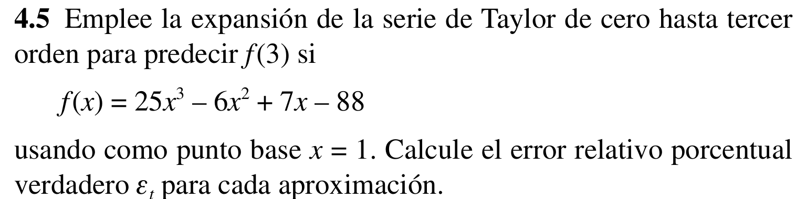
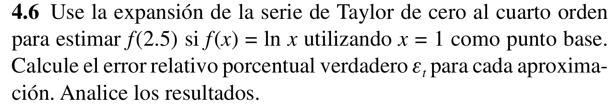
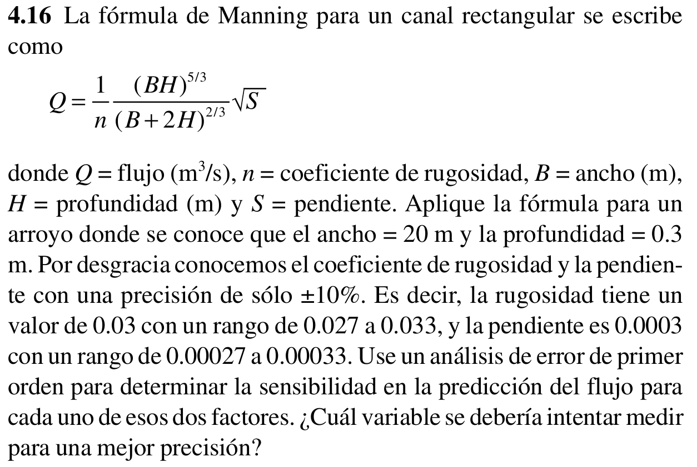

# Ejercicio 1

```{python, collapse = TRUE, echo = FALSE}
import sys
import sympy as sp

x: object = sp.symbols('x', real = True)

a: float = sp.S(25)
b: float = sp.S(6)
c: float = sp.S(7)
d: float = sp.S(88)

f: object = a*x**3 - b*x**2 + c*x - d

x0: float = 1
x1: float = 3
n: int = 3 + 1#Sumado 1 porque python no toma el ultimo valor del rango
h: float = x1 - x0

vR: float = f.subs({x:x1}) #Valor Real
fi = f
sys.stdout.write(f"\n\tValor Real = {vR}\n")
sys.stdout.write(F'\nORDEN\tt0\tt1\th\tq(t1) Aproximado\t\t\teR (%)')
for i in range(n):
    f_prima = sp.diff(f, x, i + 1)
    
    Rn = f_prima * h**(i + 1) / sp.factorial(i + 1)
    vA = sp.N(fi.subs({x:x0})) #Valor Aprocimado
    eRp = (vR - abs(vA))/vR * 100 #Error relativo porcentual
    sys.stdout.write(F'\n{i}\t{x0}\t{x1}\t{h}\t{vA}\t{eRp}')
    fi += Rn

sys.stdout.write('\n--------------------Fin de programa--------------------\n')
```
## Salida en Pantalla
```{python, collapse = TRUE, echo = FALSE}
        Valor Real = 554.000000000000

ORDEN   t0      t1      h       q(t1) Aproximado        eR (%)
0       1.0     3.0     2.0     -62.0000000000000       88.8086642599278
1       1.0     3.0     2.0     78.0000000000000        85.9205776173285
2       1.0     3.0     2.0     354.000000000000        36.1010830324910
3       1.0     3.0     2.0     554.000000000000        0
--------------------Fin de programa--------------------
```
# Ejercicio 2

```{python, collapse = TRUE, echo = FALSE}
import sys
import sympy as sp

x: object = sp.symbols('x', real = True)

f: object = sp.ln(x)

x0: float = 1
x1: float = 2.5
n: int = 4 + 1#Sumado 1 porque python no toma el ultimo valor del rango
h: float = x1 - x0

vR: float = f.subs({x:x1}) #Valor Real
fi = f
sys.stdout.write(f"\n\tValor Real = {vR}\n")
sys.stdout.write(F'\nORDEN\tt0\tt1\th\tq(t1) Aproximado\teR (%)')
for i in range(n):
    f_prima = sp.diff(f, x, i + 1)
    
    Rn = f_prima * h**(i + 1) / sp.factorial(i + 1)
    vA = sp.N(fi.subs({x:x0})) #Valor Aprocimado
    eRp = abs((vR - vA)/vR * 100) #Error relativo porcentual
    sys.stdout.write(F'\n{i}\t{x0}\t{x1}\t{h}\t{vA}\t{eRp}')
    fi += Rn

sys.stdout.write('\n--------------------Fin de programa--------------------\n')
```
## Salida en Pantalla
```{python, collapse = TRUE, echo = FALSE}
Valor Real = 0.916290731874155

ORDEN   t0      t1      h       q(t1) Aproximado        eR (%)
0       1.0     2.5     1.5     0       100.000000000000
1       1.0     2.5     1.5     1.50000000000000        63.7035001905937
2       1.0     2.5     1.5     0.375000000000000       59.0741249523516
3       1.0     2.5     1.5     1.50000000000000        63.7035001905937
4       1.0     2.5     1.5     0.234375000000000       74.4213280952197
5       1.0     2.5     1.5     1.75312500000000        91.3284658477564
6       1.0     2.5     1.5     -0.145312500000000      115.858776580964
7       1.0     2.5     1.5     2.29553571428571        150.524820827391
8       1.0     2.5     1.5     -0.908077566964286      199.103650771075
9       1.0     2.5     1.5     3.36340680803572        267.067644693546
10      1.0     2.5     1.5     -2.40309709821428       362.263604183691
--------------------Fin de programa--------------------
```
## Analisis
    - El error se va haciendo mas grande.
    - El valor aproximado es inestable y va fluctuando (se va alejando del valor real).

# Ejercicio 3

```{python, collapse = TRUE, echo = FALSE}
import sys
import sympy as sp

B = sp.symbols('B', real = True)
H = sp.symbols('H', real = True)
S = sp.symbols('S', real = True)
n = sp.symbols('n', real = True)

Q = (B*H)**(5/3)*sp.sqrt(S)/(n*(B + 2*H)**(2/3)) #Funcion Q(B, H, S, n)

#Derivadas Parciales
dQ_dB = sp.diff(Q, B)
dQ_dH = sp.diff(Q, H)
dQ_dS = sp.diff(Q, S)
dQ_dn = sp.diff(Q, n)

#Entrada de Datos 
sys.stdout.write("\n\t-Ingresar valores separados por espacios (a b c).")
sys.stdout.write("\n\t-Usar punto para valores con decimales (0.1).")

#Imprimiendo funcion H(B, H, S, n)
# sp.pprint(H)

Bi: float = 20
Hi: float = 0.3
Si: float = 0.0003
ni: float = 0.03

eB = 0
eH = 0
eS = 0.1
en = 0.1

#Error estimado de H
eQ = dQ_dB*eB + dQ_dH*eH + dQ_dS*eS + dQ_dn*en

#Evaluando las funciones Q(B, H, S, n) y Delta_Q(B, H, S, n) en 
#los puntos Bi, Hi, Si, ni, eB, eH, eS, en. 
eQ_eval: float = sp.N(eQ.subs({B:Bi, H:Hi, S:Si, n:ni}))
Q_eval: float = sp.N(Q.subs({B:Bi, H:Hi, S:Si, n:ni}))

#Salida en Pantalla
sys.stdout.write('\n=============SOLUCIÓN=============')
sys.stdout.write(f'\nQ = {Q_eval}')
sys.stdout.write(f'\neQ = {eQ_eval}')
sys.stdout.write(f'\nQ - eQ = {Q_eval - eQ_eval}')
sys.stdout.write(f'\nQ + eQ = {Q_eval + eQ_eval}')
sys.stdout.write('\n===========FIN PROGRAMA===========\n')

```
## Salida en Pantalla
```{python, collapse = TRUE, echo = FALSE}
=============SOLUCIÓN=============
Q = 1.52211211628721
eQ = 248.611645660244
Q - eQ = -247.089533543957
Q + eQ = 250.133757776531
===========FIN PROGRAMA===========
```